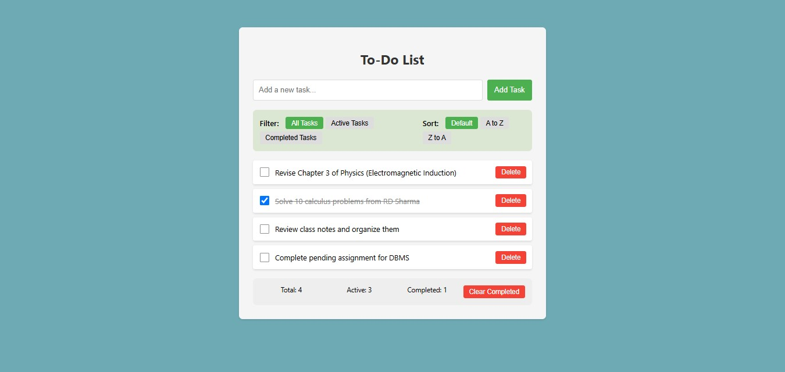

echo "# React To-Do List Application

A feature-rich to-do list application built with React that includes:
- Task addition with validation
- Task completion marking
- Task deletion
- Filtering (All/Active/Completed)
- Sorting (None/A-Z/Z-A)
- LocalStorage persistence
- Responsive design

## Features

- Add new tasks with input validation
- Mark tasks as complete/incomplete
- Delete tasks
- Filter tasks by status
- Sort tasks alphabetically
- All data persists in localStorage
- Clean, responsive UI

## Installation

1. Clone the repository:
   \`\`\`bash
   git clone https://github.com/Saurabh8757/Todo-List-Assignment-2-.git
   \`\`\`
2. Install dependencies:
   \`\`\`bash
   cd react-todo-list
   npm install
   \`\`\`
3. Run the application:
   \`\`\`bash
   npm start
   \`\`\`

## Testing Guidance

### Manual Testing

1. **Adding Tasks**:
   - Type a task in the input field and click \"Add Task\"
   - Try adding an empty task (should be prevented)
   - Verify tasks appear in the list

2. **Completing Tasks**:
   - Click the checkbox next to a task
   - Verify the task gets a line-through style
   - Check the \"Active\" filter to confirm it disappears from active tasks

3. **Deleting Tasks**:
   - Click the \"Delete\" button next to a task
   - Verify the task is removed from the list
   - Refresh the page to confirm it's gone permanently

4. **Filtering**:
   - Create a mix of completed and active tasks
   - Test each filter (All, Active, Completed)
   - Verify only the correct tasks show for each filter

5. **Sorting**:
   - Add several tasks with different names
   - Test \"A-Z\" and \"Z-A\" sorting
   - Verify the alphabetical order is correct

6. **Persistence**:
   - Add some tasks and mark some as complete
   - Refresh the page
   - Verify all tasks and their completion status are preserved

### Automated Testing (Optional)

To run the included React tests:
\`\`\`bash
npm test
\`\`\`

## Technologies Used

- React
- JavaScript (ES6+)
- HTML5
- CSS3
- localStorage for persistence

## Screenshot

## License

MIT" > README.md